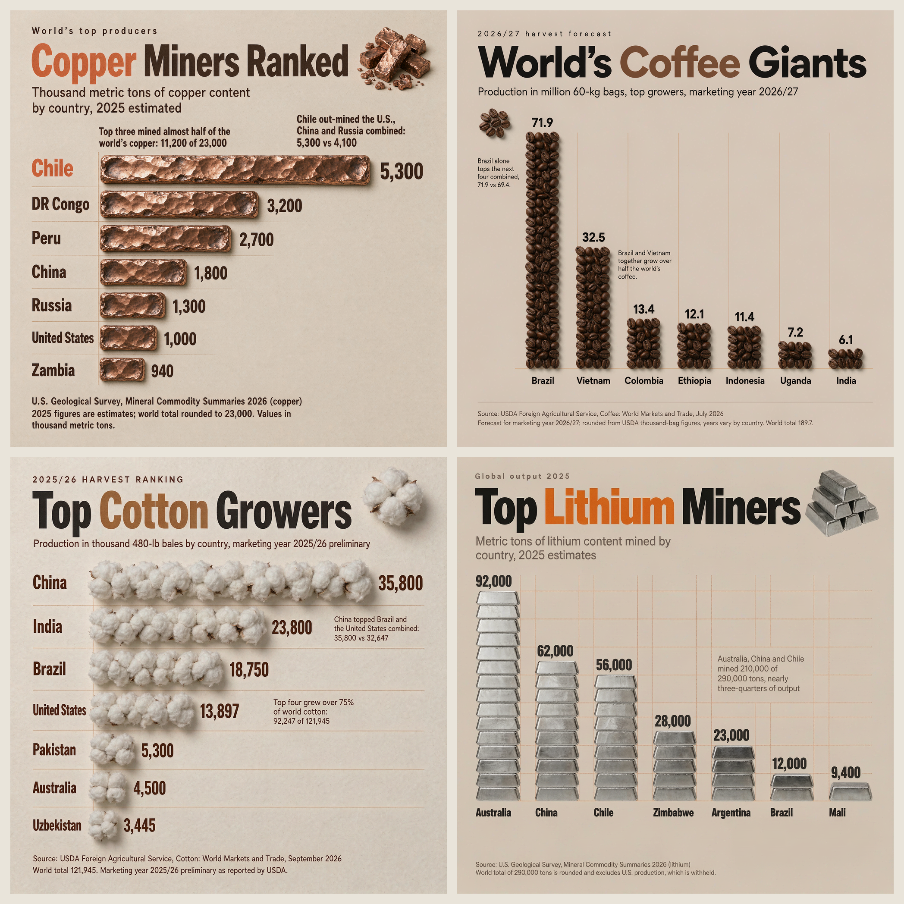
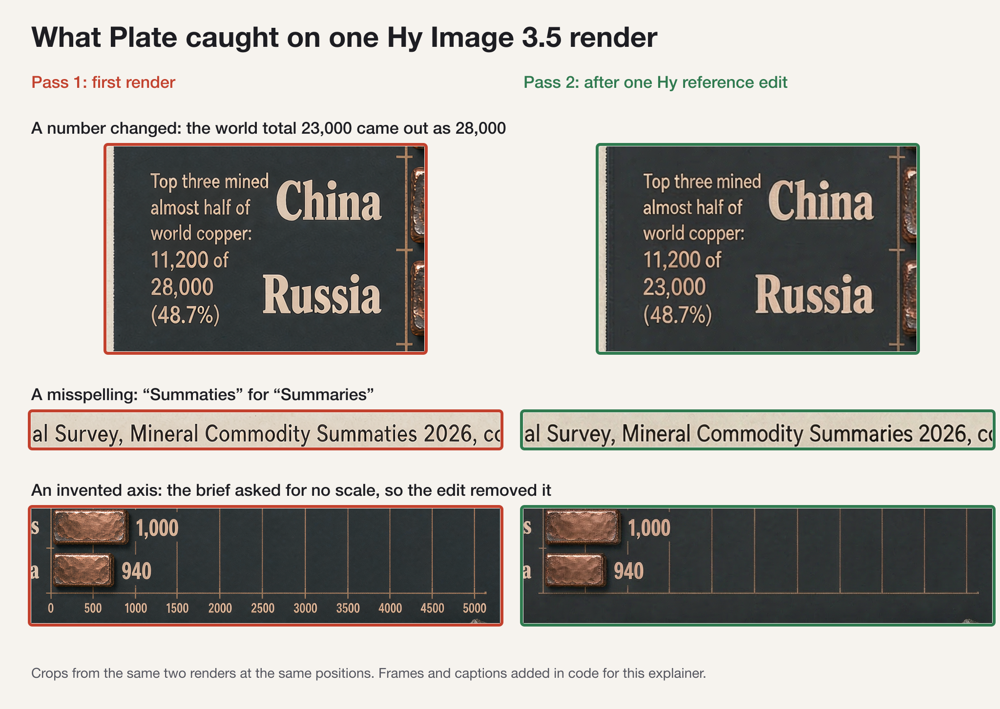

# Material Facts

Hy Image Challenge · Type & Layout

Four knowledge infographics in one visual system. In each one, the chart is built from the material it measures: copper ingots, roasted coffee beans, raw cotton, lithium metal. Every pixel and every glyph was generated by **Hy Image 3.5 preview on GMI Cloud** at native 2048x2048. No type, lines or marks were overlaid or retouched in code.

| Piece | Chart | Source |
| --- | --- | --- |
| [Copper Miners Ranked](images/1-copper.png) | Ranked bars of hammered copper | U.S. Geological Survey, Mineral Commodity Summaries 2026, copper (2025 estimates) |
| [World's Coffee Giants](images/2-coffee.png) | Columns of roasted beans | USDA FAS, Coffee: World Markets and Trade, July 2026 (2026/27 forecast) |
| [Top Cotton Growers](images/3-cotton.png) | Ranked bars of raw cotton | USDA FAS, Cotton: World Markets and Trade, September 2026 (2025/26 preliminary) |
| [Top Lithium Miners](images/4-lithium.png) | Columns of lithium ingots | U.S. Geological Survey, Mineral Commodity Summaries 2026, lithium (2025 estimates) |

## Workflow

I built **Plate**, an infographic agent on Vercel's eve framework, with two models in its pipeline:

1. **Muse Spark 1.3** (Meta) turns verified source data into a typed design spec: story, chart form, art direction and every printable string.
2. Code compiles the spec into a Hy Image prompt in which every string to print is quoted once, with type sizes, layout rules and a worded scale check so short bars are not stretched to fit their labels. The compiled prompt for each piece is in [prompts/](prompts/).
3. **Hy Image 3.5 preview** renders the graphic on GMI Cloud.
4. Muse Spark transcribes the render blind, without seeing the spec, and code diffs the transcript against the spec: misspellings, changed numbers, missing or invented text, row order.
5. Errors are fixed with reference-guided Hy edits of the best draft so far, or a corrected re-render, for up to six passes. A worse result is discarded, never built on.

### What the check caught today

Hy renders headlines reliably; small print and numbers slip. Across today's renders for this set, including test renders, the check caught:

- a total printed as **28,000** instead of 23,000
- **"Summaties"** for "Summaries", four times across copper and lithium renders
- an **axis scale nobody asked for**, which disagreed with the bars
- whole **invented callouts**, such as "The remaining 80,000 tons come from Zimbabwe, Argentina, Brazil, Mali and other countries"

Each was fixed by a Hy reference edit that kept the composition. See [process/caught-and-fixed.png](process/caught-and-fixed.png) and the per-pass log in [process/pass-log.json](process/pass-log.json).

### Final proofread

The check reads text the way a person skims, so it can read a malformed letter as the word it expects. Every final was proofread at full resolution and every bar or column measured against its value. Two copy fixes came out of that pass, each made with a single Hy reference edit:

- Cotton: the "q" in "three-quarters" rendered like a "g", so the callout was reworded to "over 75%" (92,247 of 121,945 is 75.6%). [process/edit-consistency.png](process/edit-consistency.png) shows that edit changed that callout and nothing else.
- Copper: earlier drafts used clipped callout copy, so the final copper piece was re-rendered with the wording fixed in the brief.

## Data

Every number was taken from the primary source and checked a second time against the same table by an independent pass. Data research and verification were assisted by Claude Code (Anthropic) as a development tool; it is not part of Plate's generation pipeline.

- Copper: USGS MCS 2026, copper chapter, table "World Mine and Refinery Production and Reserves", column "Mine production 2025e", printed page 73. Thousand metric tons, copper content.
- Coffee: USDA FAS, Coffee: World Markets and Trade, July 2026, page 7, "Coffee Summary", Production, 2026/27 July forecast. Thousand 60-kg bags, shown in millions rounded to one decimal.
- Cotton: USDA FAS, Cotton: World Markets and Trade, September 2026, Table 06, 2025/26 preliminary. Thousand 480-lb bales.
- Lithium: USGS MCS 2026, lithium chapter, printed page 119, "World Mine Production and Reserves", 2025 estimates. Metric tons, lithium content; the world total excludes withheld U.S. production.

## Models

- Generation: Hy Image 3.5 preview (`hy-image-v3.5-preview`) on GMI Cloud, for every render and edit.
- Spec writing and text checking: Meta Muse Spark 1.3 Contributor.
- No other image or language model is used in Plate.

## Videos

Three cuts for X, each with burned-in captions and a matching `.srt` file. Every app shot is a real recording of Plate running locally; the run is shown sped up.

| File | Format | Length | Angle |
| --- | --- | --- | --- |
| [plate-walkthrough-16x9.mp4](videos/plate-walkthrough-16x9.mp4) | 1920x1080 | 1:47 | How to use Plate, then what the check caught, then the set |
| [plate-walkthrough-v2-16x9.mp4](videos/plate-walkthrough-v2-16x9.mp4) | 1920x1080 | 2:11 | The pick for X: why Plate wins, how it works (animated architecture, why the read-back is blind), live catches, the set, with a product-demo music bed |
| [material-facts-showcase-1x1.mp4](videos/material-facts-showcase-1x1.mp4) | 1080x1080 | 1:10 | The set first, then how it was made |
| [plate-factcheck-story-16x9.mp4](videos/plate-factcheck-story-16x9.mp4) | 1920x1080 | 2:00 | Where Hy's small print slips, how Plate catches it, including the one it missed |

The narration is ElevenLabs Eleven v4, and the v2 music bed is ElevenLabs Music, (voices Matilda, George and Daniel); every line was transcribed back with ElevenLabs Scribe and checked against the script. The videos were rendered frame by frame from an HTML timeline in headless Chrome and encoded with ffmpeg; the scripts are in [videos/source/](videos/source/) (the screen captures and image assets they read are not committed).
